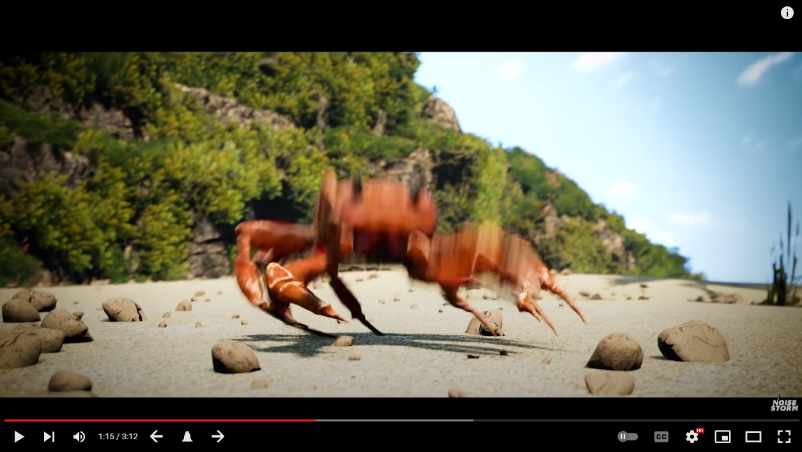

# YouTube heatmap scroller
This extension allows you to navigate a youtube video, using the "most replayed" heatmap data stored in the video.

This extension adds 3 new buttons to your video player, a previous local max button, a go to video max button, and a next local max button.

# Installation
First clone the repository, then run

`npm install`

`npm run build`

## Adding to Chrome

To load the extension onto chrome, go to your chrome extensions page, turn on developer mode, and click **load unpacked**, then select the **'dist'** directory in the repo.

# Credits
Credit to `https://betterprogramming.pub/creating-chrome-extensions-with-typescript-914873467b65` which is the guide I followed to setup TypeScript.